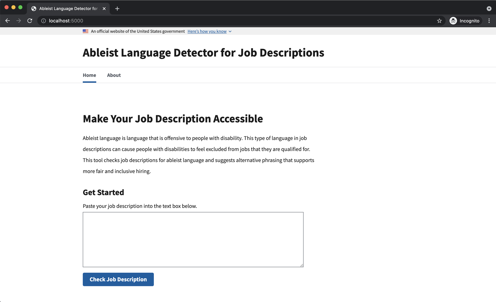

## Content

- [Project Overview](#Project-Overview)
- [Installation](#Installation)
- [Usage](#Usage)
- [About Office of Disability Employment Policy (ODEP)](#About-ODEP)
- [About Ableist Language](#About-Ableist-Language)
- [About Harvard T4SG](#About-Harvard-Tech-For-Social-Good)
- [Questions?](#Questions?)


## Project Overview

The Department of Labor Office of Disability Employment Policy (DOL ODEP) and xD Census is building out an [NLP-powered tool](https://github.com/USDepartmentofLabor/ableist-language-detector) to identify ableist language (i.e. language that is offensive to people with disabilities) in job descriptions. This tool will assist employers in creating awareness and actionable insights to ensure companies are being inclusive to people with disabilities.

[Harvard Computer Society (HCS) Tech for Social Good](https://socialgood.hcs.harvard.edu/) is tasked to develop a front-end web application interface to allow users to access the tool and check job descriptions for ableist language. The contributors for this projects are:
- Jamie Lu [Github](https://github.com/lujamie)
- Zad Chin [Github](https://github.com/Iwanttobeatuna)
- Kevin Tan [Github](https://github.com/kevintan250)

This repo contains the code to run a local instance of the web application. For the main python library functionality and more information on the tool, see the [USDepartmentofLabor/ableist-language-detector](https://github.com/USDepartmentofLabor/ableist-language-detector) repo.

##  Installation

### Option 1. Install via Docker

Install Docker on your machine by following the instructions in the [Docker documentation](https://docs.docker.com/get-started/).

Once you've installed Docker, build the container using the included `compose-django.yml` file:

```
docker compose -f compose-django.yml up --build
```

The application is now running and you can move on to the [Usage](#Usage) step.

### Option 2. Install without Docker

This tool requires Python >= 3.8.

Create a virtual environment (`venv` instructions are given below, but you can use any virtual environment of your choosing):

```
python3 -m venv [name of virtual environment]
. [virtualenv]/bin/activate
```

Clone this repository:

```
git clone https://github.com/USDepartmentofLabor/ableist-language-detector-web.git
```

Install the required packages:

```
cd dol-web
python -m pip install -r requirements.txt
python -m spacy download en_core_web_sm
```

The detector module should be installed now! To check the installation, run the following in a python prompt:

```
>>> import ableist_language_detector
>>> ableist_language_detector.__version__
'0.1.0'
```

Next, start a local instance of the ableist language detector web application:

```
export FLASK_APP=app
flask run
```

## Usage

After completing either the Docker or non-Docker installation commands, you'll see an output that ends in a LocalHost URL like this (the actual IP address shown will vary depending on if you are using Docker or not):

```
* Running on http://XXX.XX.X.X:5000/ (Press CTRL+C to quit)
```

Navigate to `http://localhost:5000/` in your browser and you should see the web application:



## About xD

[xD](https://www.xd.gov/) is an emerging technologies group at the U.S. Census Bureau that partners with federal agencies and universities to improve the delivery of government services using artificial intelligence.

## About DOL ODEP

The [Office of Disability Employment Policy (ODEP)](https://www.dol.gov/agencies/odep) is the only non-regulatory federal agency that promotes policies and coordinates with employers and all levels of government to increase workplace success for people with disabilities.

## About Harvard Computer Society Tech For Social Good

[HCS Tech for Social Good](https://socialgood.hcs.harvard.edu/) is a student group dedicated to empowering student leaders to leverage technology to tackle the world’s big problems. As the hub of social impact tech at Harvard, T4SG’s flagship program provides technical consulting services to nonprofits, government agencies, and social enterprises in order to amplify the work of social impact organizations and provide a space for students to get involved with and inspired by mission-driven tech work. T4SG also engages the community in social impact tech through programs, workshops, events, courses, and more.

**Work With HCS Tech for Social Good**

For more information on how to collaborate and partner with us, please visit our [website](https://socialgood.hcs.harvard.edu/) or [email us](team@sg.hcs.harvard.edu).


## Questions?
If you have any question trying to run the program, please do not hesitate to contact Harvard T4SG at: [team@sg.hcs.harvard.edu]. Thank you.

